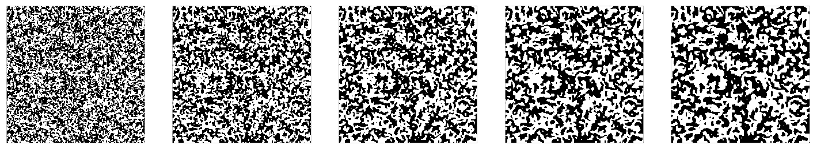

Imperial College London ReCoDE : Monte Carlo for Fun
====================================================

This is an exemplar project designed to showcase best practices in developing scientific software as part of the ReCoDE Project at Imperial College London. These docs have been generated automatically with sphinx.

You can find the source code and main landing page for this project on `GitHub <https://github.com/TomHodson/ReCoDE_MCMCFF>`_

There is a `Jupyter notebook <https://github.com/TomHodson/ReCoDE_MCMCFF>`_ detailing how this page was generated in there.

Quickstart
----------

.. code-block:: python

   from MCFF.mcmc import mcmc_generator
   from MCFF.ising_model import show_state

   ### Simulation Inputs ###
   N = 500  # Use an NxN system

   initial_state = np.random.choice(
      np.array([-1, 1], dtype=np.int8), size=(N, N)
   )  # the intial state to use

   ### Simulation Code ###
   critical_states = [
      s for s in mcmc_generator(initial_state, steps=5, stepsize=5*N**2, T= 3.5)
   ]

   fig, axes = plt.subplots(
      ncols=len(critical_states), figsize=(5 * len(critical_states), 5)
   )

   for s, ax in zip(critical_states, axes):
      show_state(s, ax=ax)

.. toctree::
   :maxdepth: 2
   :caption: Contents:

mcmc : Markov Chain Monte Carlo Routines
---------------------------------------------

.. automodule:: MCFF.mcmc
   :members:

ising_model : Ising Model Routines
---------------------------------------------

.. automodule:: MCFF.ising_model
   :members:

Indices and tables
==================

* :ref:`genindex`
* :ref:`modindex`
* :ref:`search`
